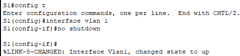

# PRACTICA BASTIONADO 2

## Parte 1: Configurar direcciones IP a los dispositivos de las diferentes redes

### Paso 1: Accedemos al PC0 y configuramos su direccion IP

## Parte 2: Establecer dirección IP al switch para poder acceder remotamente mediante Telnet

