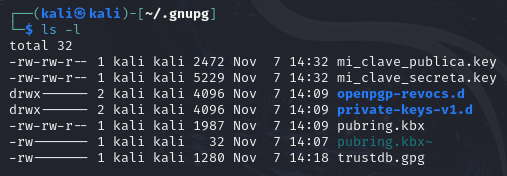
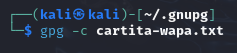

# Práctica BRS: GPG usando Linux

## Requisitos previos

- PC con acceso a Internet
- Máquina virtual con [Kali Linux](https://www.kali.org/get-kali/#kali-virtual-machines) (o cualquier otra distribución)
- Software [MobaXterm](https://mobaxterm.mobatek.net/download-home-edition.html)

## Proceso

### 1. Creación llaves GPG

- Ejecutaremos el comando `gpg --gen-key` en la terminal de nuestra máquina Linux. Nos pedirá nuestro nuestro nombre e email y nos pedirá que confirmemos los datos.
  
- Una vez hecho, nos pedirá una `passphrase` (**pandora27** en mi caso) para proteger las claves.
  
- Tras darle a `OK` y esperar un poco, nos generará las claves y nos mostrará un breve resumen de lo que hemos hecho.
  
- Para ver todas las claves que tenemos usaremos el comando `gpg --list-keys`
  

### 2. Exportar la claves

- Usaremos el comando `cd ~/.gnupg` para irnos al directorio oculto donde se encuentran las claves GPG de nuestro sistema (se almacenan ahí por defecto)
  
- Ejecutamos el comando `gpg --export -a nombreAsignado > mi-clave-publica.key`, siendo `nombreAsignado` el nombre que hayamos introducido al crear la clave. En mi caso `Alejandro Rios`
  
- Con el comando `gpg --export-secret-key -a nombreAsignado > mi-clave-publica.key` haremos exactamente lo mismo, pero exportaremos la clave privada.
  
- Nos pedirá la contraseña que introdujimos anteriormente y tras darle a `OK` se exportará clave.
  
  

### 3. Importar una clave pública
Usaremos el software [MobaXterm](https://mobaxterm.mobatek.net/download-home-edition.html).

- Crearemos una conexión SSH con la máquina virtual (debe tener **SSH** habilitado)

- Le daremos a `OK` y tras eso nos pedirá una contraseña maestra (**NO COMPARTIR ESTA CONTRASEÑA**). Una vez introducida le daremos a `OK`

- Nos pedirá la contraseña de la máquina (en mi caso `kali`)

pide passphrase

### 4. Encriptación simétrica

pide contraseña cualquiera

