

# Práctica de Bastionado de Redes y Sistemas: Gestor de Contrseñas

Esta práctica trata de abordar el proceso de instalación, configuración y funcionamiento de la aplicación Bitwarden, un gestor de contraseñas, para poder almacenar y proteger contraseñas de nuestras cuentas personales.

## Instalación

1. Nos dirigiremos a la página de descarga de [Bitwarden](https://bitwarden.com/es-la/download/). Ahí tendremos varias opciones para poder usar la aplicación.
2. Nos iremos hacia abajo hasta la parte de aplicaciones de escritorio y haremos click en nuestro sistema operativo para descargar el instalador.
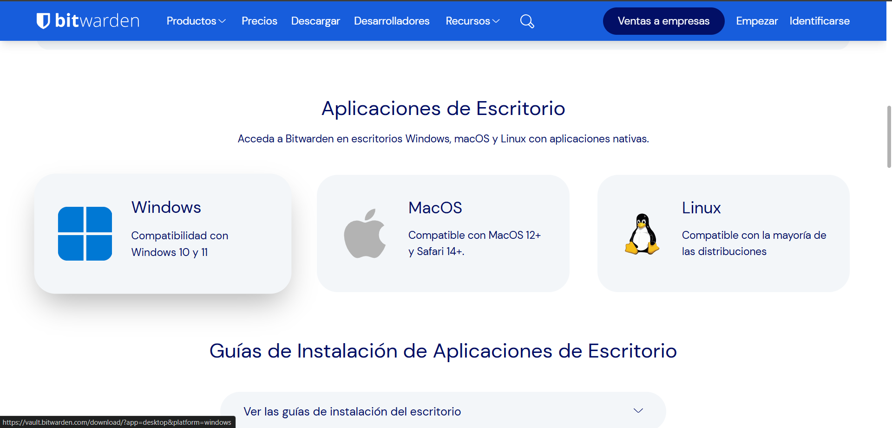

3. Una vez terminada la descarga, abriremos el ejecutable y empezaremos con la configuración, dejándolo todo por defecto.
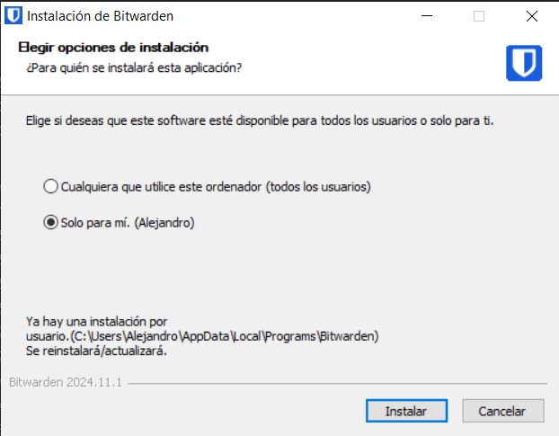
4. Una vez acabado todo, lo ejecutaremos.
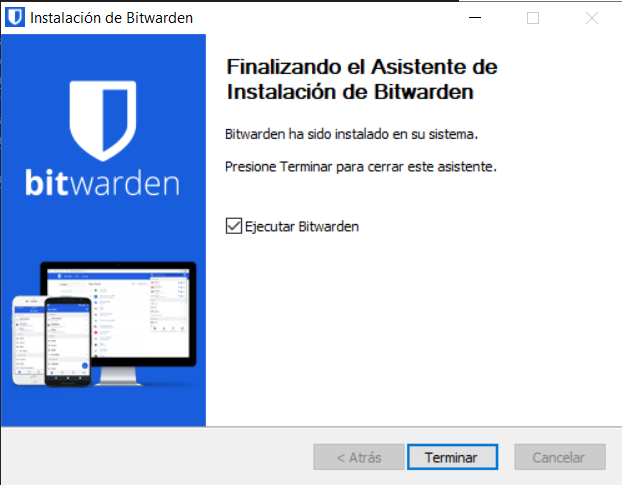

5. Una vez abramos la aplicación, nos pedirá nuestra cuenta de Bitwarden. Si no tenemos ninguna, deberemos hacer click para ir a su página web y crear allí una.

6. Deberemos crear una contraseña maestra que será la que nos permita acceder al resto y nos servirá para poder acceder a nuestra cuenta de Bitwarden.
7. Una vez hayamos terminado, podremos acceder a Bitwarden.

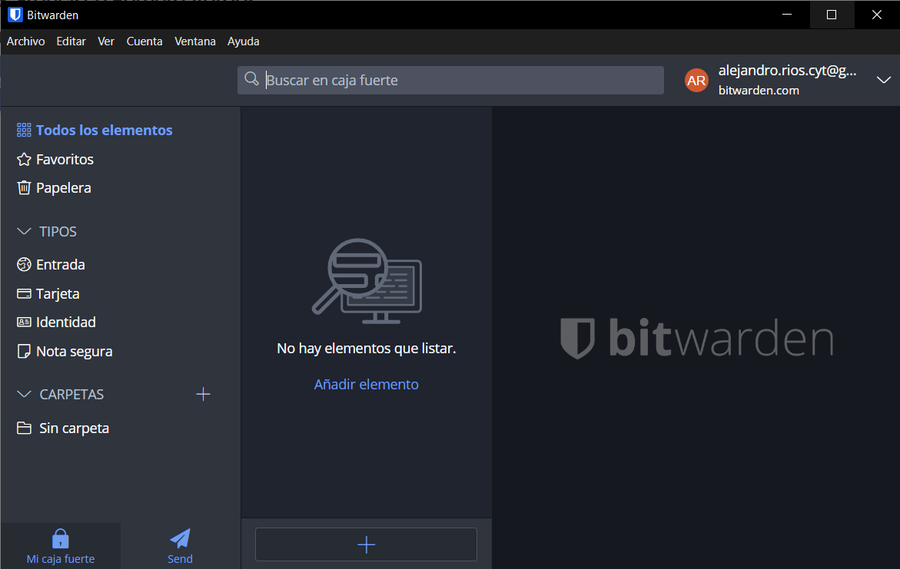

## Almacenar credenciales
Las credenciales son aquellos datos que usamos a menudo para poder acceder a nuestras cuentas de distintos sitios. Almacenarlas en Bitwarden nos permite despreocuparnos de tener que memorizarlas todas y las blindamos gracias a su sistema de cifrado avanzado. A continuación, se explica como almacenar estas.
1. Haremos click en el botón `+` que se encuentra en la parte inferior.
   
2. Nos abrirá en el margen derecho de la aplicación un formulario donde podremos rellenar con nuestros datos las credenciales que queremos almacenar.
   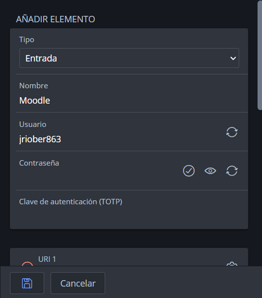
3. Bitwarden incorpora un generador de contraseñas seguras. Podremos abrirlo dando click en el icono de la derecha en el campo de contraseña.
   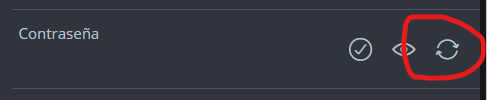
   Nos abrirá la siguiente ventana donde podremos ajustar los requisitos de la contraseña como queramos.
   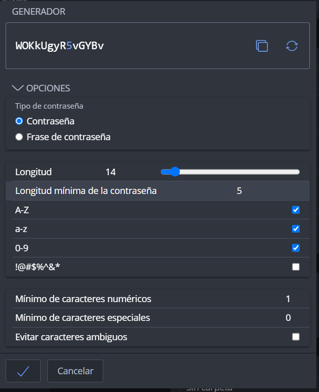
4. Una vez acabado todo, daremos click en el icono de guardar.
   
   Ahora la información que hemos guardado nos aparecerá en el centro y, al hacer click, en el margen derecho de la pantalla.
   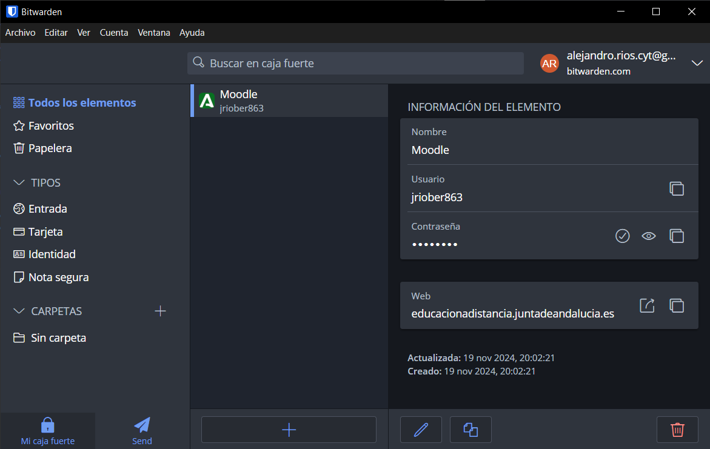

## Habilitar 2FA (autenticacion en dos pasos)
La autenticación en dos factores (2FA) añade una capa extra de seguridad a nuestras cuentas, requiriendo una segunda manera además de la contraseña para comprobar que el inicio de sesión con nuestras credenciales no es fraudulento. Activar 2FA en Bitwarden mejora la protección de las credenciales, ya que incluso si alguien obtuviera la contraseña maestra, no podría acceder a nuestra cuenta sin el código adicional.

Para activar la autenticación se sigue este método:
1. En la aplicación de Bitwarden haremos click en `Cuenta`, lo que nos abrirá un desplegable, y haremos click en `Autenticación en dos pasos`.
   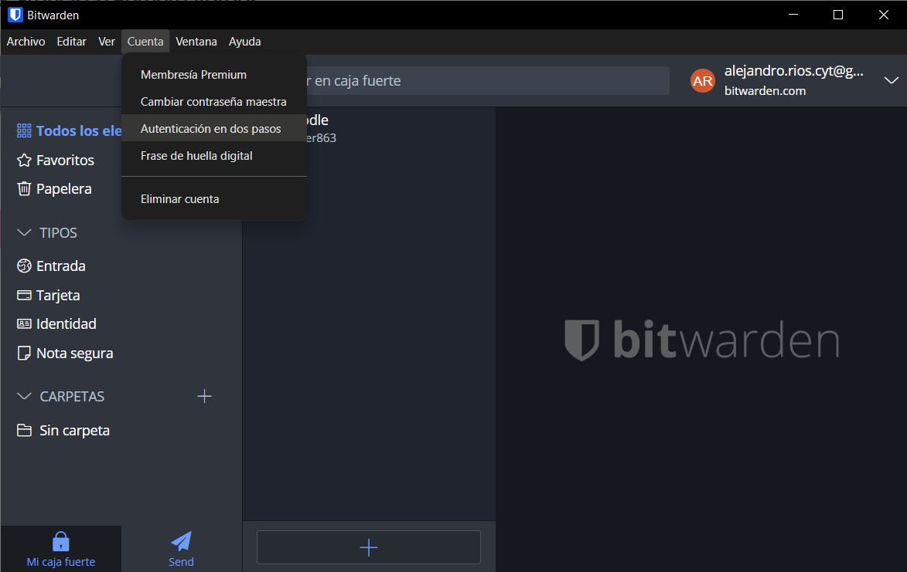
   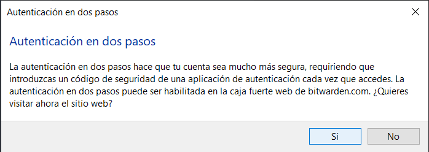
2. Nos iremos a la configuración de seguridad de la cuenta
   
3. Una vez allí nos iremos a la parte de `Two-step login`.
   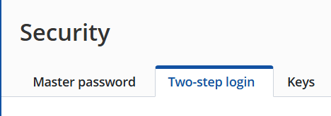
4. Allí nos aparecerán las distintas opciones que tenemos para llevar acabo la doble autenticación. En mi caso seleccionaré `Email`.
4. Se nos abrirá una pequeña ventana donde se nos pedirá la contraseña maestra.
   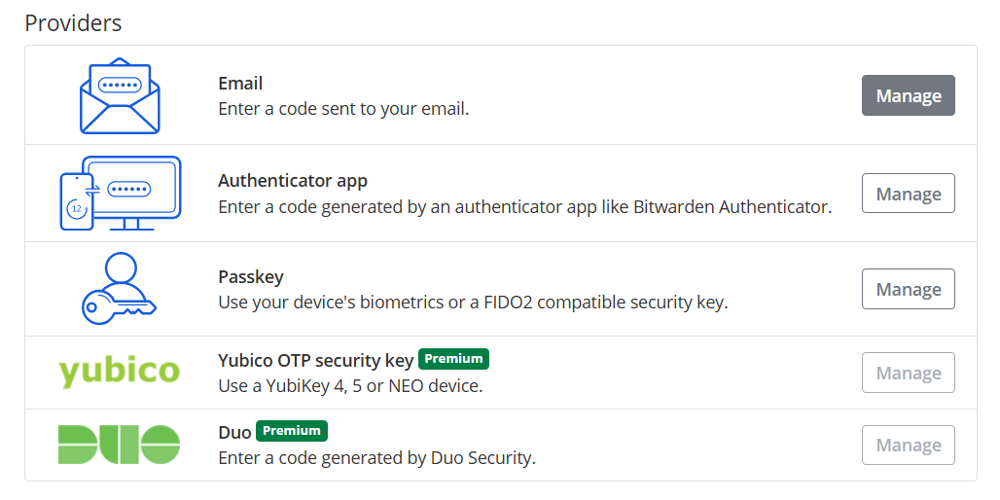
5. 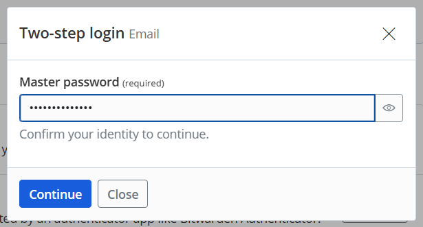
   Tras esto deberemos introducir el correo donde queremos que nos manden los códigos y enviarnos el primero para confirmar este nuevo cambio.
6. 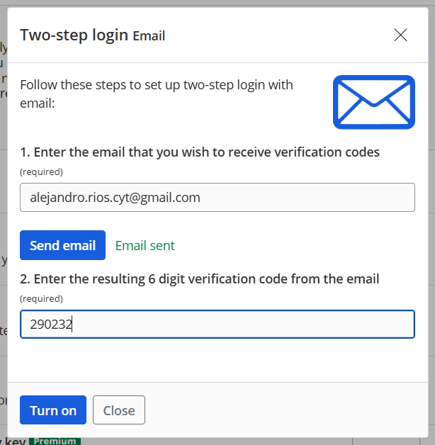
7. Se nos confirmarán los cambios de forma visual.
   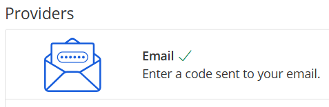 