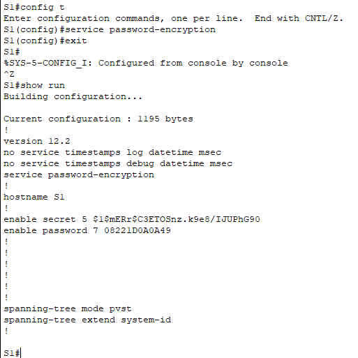

# Primera Práctica de Bastionado de Redes y Sistemas

## Instalación inicial

Colocamos dos switches 2960 y dos PCs con DHCP habilitado, conectando todo a su vez tal y como está indicado en la foto

Tras esto, cambiamos los nombres de los dispositivos.

## Parte 1: Verificar la configuración predeterminada del switch

### Paso 1: Ingresar al modo EXEC privilegiado

1. Hacemos click en S1 y luego en CLI para acceder a la línea de comandos del switch. Aquí podremos realizar la configuración mediante comandos de terminal.
2. Ingresamos al modo EXEC escribiendo `enable`. Visualizaremos el nuevo modo gracias al `#`.
   

### Paso 2: Examinar la configuración actual

1. Introducimos el comando `show running-config`. Esto nos proporciona una vista de la configuración actual del switch.

   

## Parte 2: Configuración básica del switch

### Paso 1: Asignación de nombre al switch
1. Para asignarle un nombre al switch, dentro del modo `EXEC`, deberemos escribir `configure terminal` para empezar a introducir los comandos de configuración.
2. Con el comando `hostname S1` cambiaremos el nombre del switch a `S1`
3. Escribiremos `exit` para salir del modo de configuración.

### Paso 2: Acceso seguro a la línea de consola
1. Accedemos a la configuración del switch con `configure terminal`
2. Introducimos `line console 0`
3. Introducimos una contraseña de acceso con `password 413j4nDr0!`
4. Escribimos `login` para iniciar la sesión y finalmente `exit` para salir

### Paso 3: Verificar acceso a consola seguro
Si salimos y volvemos a entrar al CLI o si volvemos a escribir `exit` en la terminal, nos pedirá que introduzcamos una contraseña para poder acceder.

### Paso 4: Acceso seguro al modo privilegiado
Para poder poner una contraseña al modo prvilegiado, lo realizaremos de la siguiente manera:
1. Escribiremos `enable` para entrar al modo `EXEC`
2. Después, `configure terminal` para acceder a la configuración de la terminal
3. Por último, escribiremos `enable password c1$c0` para poder asignar una contraseña cuando tratemos de entrar al modo privilegiado

### Paso 5: Verificar acceso seguro al modo privilegiado
Si salimos y volvemos a entrar, comprobaremos que ahora además de pedirnos la contraseña cuando tratemos de acceder al CLI, nos la pedirá si tratamos de acceder al modo privilegiado al escribir `enable`

### Paso 6: Configurar contraseña encriptada para proporcionar acceso seguro al modo privilegiado
Ahora cifraremos la contraseña que hemos puesto. Para ello seguiremos los siguientes pasos.
1. Dentro del modo `EXEC`, al cual accedemos escribiendo `enable`, entraremos en la configuración de la terminal escribiendo `config t` (una forma acortada)
2. Tras ello escribiremos el comando `enable secret 413j4NdR0!` para cifrar la contraseña introducida (destacar que al hacer esto modificamos también la anterior contraseña `c1$c0`)

### Paso 7: Verificar si la contraseña de encriptada se agregó al archivo de configuración
Vamos a comprobar que lo hemos realizado correctamente. Para ello usaremos el comando `show run` (forma acortada) y comprobaremos que ahora la contraseña se encuentra cifrazada con caracteres alfanuméricos.

### Paso 8: Encriptar contraseñas de consola y enable
1. Accedemos a la configuración de la terminal con `config t`
2. Escribimos `service password-encryption` para habilitar la encriptación de las contraseñas.

## Parte 3: Contraseña de telenet o SSH

1. Accedemos a la configuración de la terminal con `config t`
2. Escribimos `line vty 0 4`, lo que nos permitirá configurar las líneas de acceso remoto
3. Introducimos una contraseña con  `password password` y finalmente `login`

## Parte 4: Contraseña de auxiliar

No permitida en el switch de la práctica

## Parte 5: Aviso de MOTD

### Paso 1: Configurar un aviso de mensaje del día
1. Dentro de la configuración de la terminal (`config t`), escribimos `banner motd #ACCESO NO AUTORIZADO#`, lo que nos permitirá asignar un mensaje para todo usuario que trate de acceder al CLI

Como podemos ver, al intentar acceder de nuevo al CLI, nos aparece el mensaje que hemos asignado

## Parte 6: Guardar y verificar archivos de configuración en NVRAM

### Paso 1: Verificar que la configuración sea precisa mediante el comando show run
Por último, comprobamos todos los cambios que hemos realizado.

Solo nos quedaría repetir todo el proceso de la misma manera con el segundo switch y estaría todo completo.